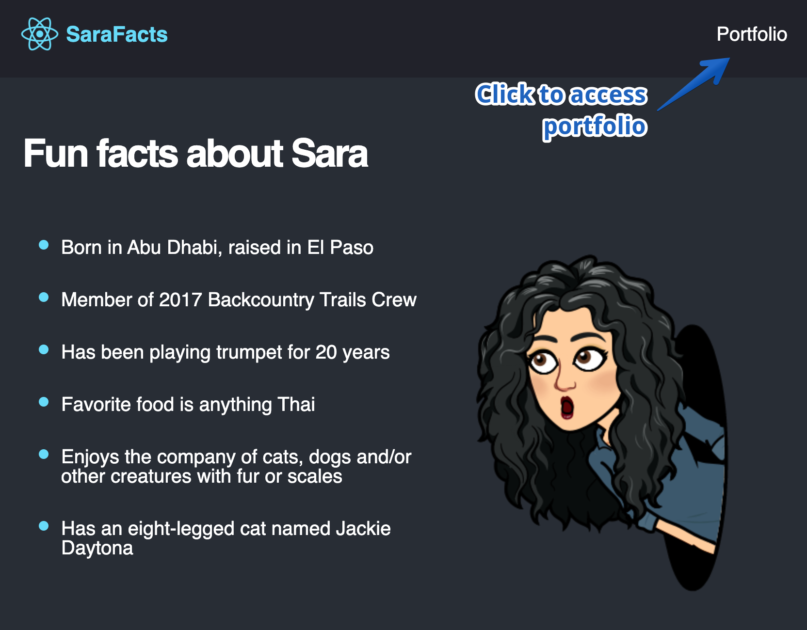

# Fun Facts React Card

## Deployed Link
[Sara Facts](https://scintillating-rabanadas-94bbfb.netlify.app/)

## Description
This one page static app was created to practice building components using React. When a user visits the deployed link, they will be presented with a NavBar containing a link to my portfolio and an unordered list of random facts.

## Contributing
[Sara Baqla](https://github.com/missatrox44) 

## Questions
Github username: [missatrox44](https://github.com/missatrox44)  
Email: missatrox44@gmail.com
